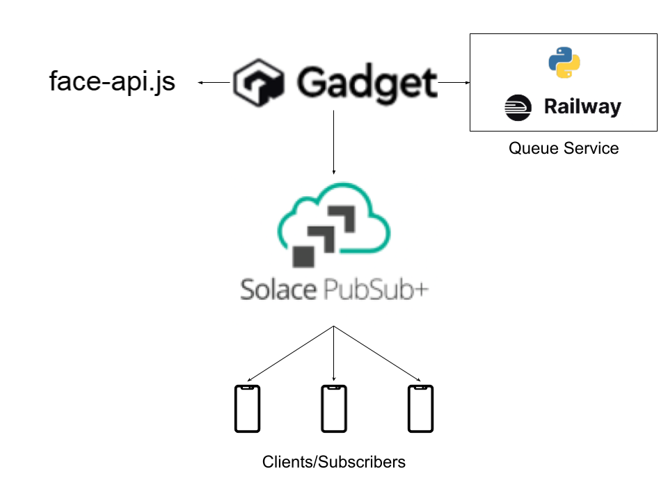

# Qpid
A better way to wait in line
## Inspiration
Wating in line sucks. Every hackathon I've been to, I've seen people waiting in line for hours. That's wasted time that could've been spent improving their product and in a hackathon where time is limited, every second counts.
## Core Idea
The idea behing our product is that you can wait in line without having to wait in line. Using a virtual queueing system, you can join a queue and wait for your turn to be called. You can also see how many people are in front of you.
## What it does
Our product allows users to join a queue and wait for their turn to be called. They can also see how many people are in front of them. We also have an admin dashboard to manage queues.
## How we built it
We used Gadget to build our backend and frontend. We have a python application hosted on Railway that does all the queueing logic. Solace PubSub+ is at the core of our queueing system. We use it to notify users when it's their turn to be called.
## Challenges we ran into
We found it difficult learning how to use Gadget and Solace PubSub+. Gadget was very different from what we were used to, we ran into many issues trying to work collaboratively with it. We found it to not be all that intuitive and not as customizable as we would've liked. We did appreciate how quick and easy it was to deploy our application with Gadget. Solace PubSub+ was also quite difficult to set up. We spent a lot of time learning how to use it and getting it to work with our application.
## Accomplishments that we're proud of
We are proud of having learnt how to use Gadget and Solace PubSub+. We are quite happy with the end product we created and believe it has a lot of potential.
## What we learned
We learned plenty of new things. We learnt how to use Gadget and Solace PubSub+. We also learnt how to use Railway to host our application and how to deploy a facial recognition model on a website.
## What's next for JustVent
- Upgrading our infrastructure
- Improving our UI
- Adding new features
- Implementing a subscription model
- Adding secure authentication
## Features
- Admin dashboard to manage queues
- Live notifications to users when it's their turn
- Facial recognition to verify users
- Queue position tracking
## Architecture

Gadget is our backend and frontend. We use Solace PubSub+ to notify users when it's their turn to be called. We use Railway to host our python queueing application.

## Tech Stack
- Gadget
- Solace PubSub+
- Railway
- Python
